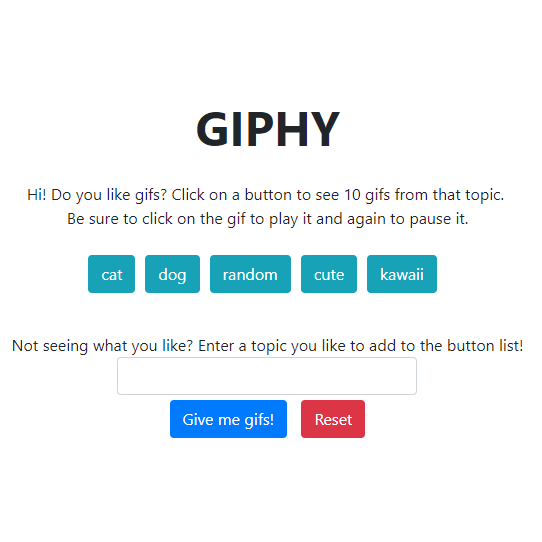

# Giphy

## Link to deployed app: [https://plsenh.github.io/Giphy/](https://plsenh.github.io/Giphy/)

---

## Overview:

Users can populate this dynamic webpage with gifs based on the topic chosen. They can also add new topics to the list and reset to the starting list and clear the page.

---

## Built with:

- [Bootstrap](https://getbootstrap.com/) - Front-end component library for developing with HTML, CSS, and JS.
- CSS3
- [Giphy API](https://developers.giphy.com/) - API to incorporate GIPHY's vast library of gifs to apps.
- HTML5
- [JavaScript](https://developer.mozilla.org/en-US/docs/Web/JavaScript) - High-level programming language.
- [jQuery](https://jquery.com/) - JavaScript library.
- [Visual Studio Code](https://code.visualstudio.com/) - Source code editor developed by Microsoft.

---

## Author:

- **Pauline Senh** - [plsenh](https://github.com/plsenh)
